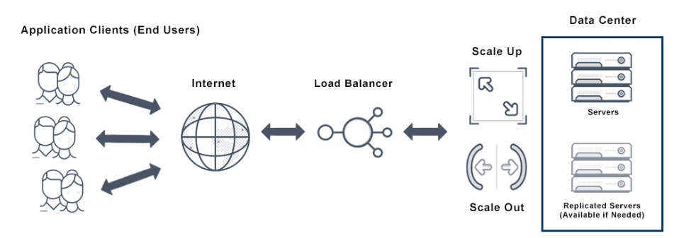

# Auto Scaling

- Auto scaling is a cloud computing feature that enables organisations to scale vloud services such as server capacities or VMs up or down automatically based on defined situations such as traffic or utlisation levels. 
- AWS, GCP and Azure offer this service

## Key Benefit
- The overall benefit of autoscaling is that it eliminates the need to respond manually in real-time to traffic spikes that merit new resources and instances by automatically changing the active number of servers. Each of these servers requires configuration, monitoring and decommissioning, which is the core of autoscaling.

## Auto scaling Groups
- An auto scaling group is a logical collection of Amazon EC2 instances for automatic scaling purposes. Each Amazon EC2 instance in the group will be subject to the same auto scaling policies.

## Difference between Load Balancing and Auto Scaling?
- Elastic load balancing and application autoscaling are closely related. Both application auto scaling and load balancing reduce backend tasks such as monitoring the health of servers, managing the traffic load among the servers, and increasing or reducing servers pursuant to requirements.
- ***BUT ARE DIFFERENT***
- Autoscaling allows a user to set a policy based on predefined criteria that manage the number of available instances in both peak and off-peak hours. This enables multiple instances with the same functionality—parallel capabilities increasing or decreasing depending on demand.
- In contrast, an elastic load balancer simply checks the health of each instance, distributes traffic, and connects each request to appropriate target groups. If it detects an unhealthy instance, an elastic load balancer stops traffic to that instance and sends data requests elsewhere. It also prevents any one instance from being swamped by requests.

## What is High Availability?
- Availability is used to describe the period of time when a service is available, as well as the time required by a system to respond to a request made by a user. 
- High availability is a quality of a system or component that assures a high level of operational performance for a given period of time.