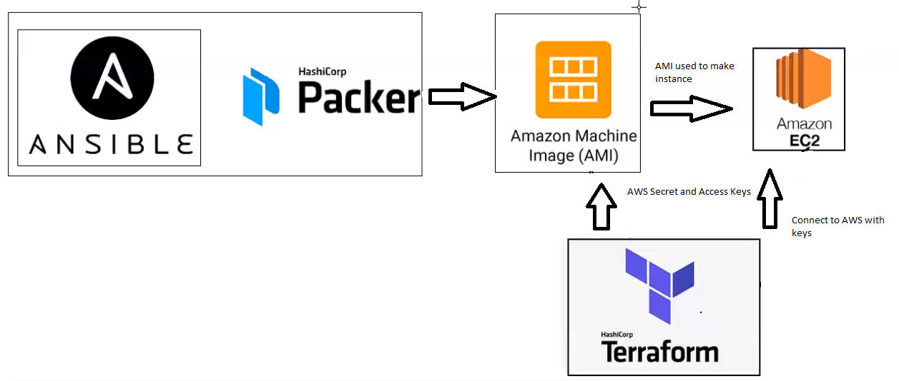

# Terraform
**What is Terraform?**

- Designed to automate the deployment of servers and other infrastructure
- Similar to Ansible i.e. configuration management tool
- It is a Hashicorp product
- It is essentially a infrastructure provisioning tool (IAC orcheastration tool)

## Why Terraform?
- Allows you to describe your infrastructure as code and create execution plans:
  - These outline what will happen when code runs
  - Build graphs of resources
  - Automate changes.
- Helps you scale up and down as per the user demand 

## Use Cases
- Terraform allows you to automate infrastructure from multiple cloud providers simultaneously.
- Cloud independent - works with AWS-Azure-GCP and others

## Language used is HCL similar to json in terms of Syntax
- Written in HCL -> similar to JSON in syntax:

- To start terraform in your directory -> `terraform init` (Creates a `.terraform` folder and a `terraform.lock.hcl` file)
- To check terraform files for errors -> `terraform validate`
- To see the actions done when ran -> `terraform plan` 
- Terraform reads access and secret keys automatically, so no need to specify them in the file 
- To run terraform/Launch instance -> `terraform apply` 
  - Security groups are DEFAULT i.e. port 80 from everywhere
- Now your instance should be up and running on AWS in under 40 secs!!

# Setting up the App with Packer, Ansible and Terraform
1. First we need to have created ansible playbooks which when ran, create both the app on an instance as well as the mongodb on another instance. 
   
2. Now we can create our AWS AMIs by utilising Packer (see files in the folder). Install Packer as described on the Hashicorp [website](https://www.packer.io/downloads). 
   
3. The code will create a "snapshot" of an instance that is created by running the ansible playbooks for both the app and db. These two AMIs can then be used to created instances with the functionality described in the playbooks.
Packer described in more detail [here](https://github.com/MattSokol79/IAC-with-Ansible-and-Packer/blob/main/PACKER.md).

3. Once the AMIs have been successfully created by running `packer build <file>` we can now begin writing terraform files to create instances using the AMI snapshots.
   
4. Install Terraform as described on the Hashicorp [website](https://www.terraform.io/downloads.html). 
   
5. Once Terraform is installed run `terraform init` in a directory where you want all your work saved. Now we will be able to run the `.tf` files which will have code to create relevant instances. 
   
6. Create 3 `.tf` files -> `main.tf`, `security_groups.tf` and `variable.tf`. The main file will have code which will create the app and db instances based off of the AMIs created using Packer. The security groups file will have the security groups for the 2 instances, including both the ingress/inbound and engress/outbound rules. The variable file will have any variables that can be written down to reduce the amount of code written in the main file.  

`main.tf`
**db_instance:**
```
# Which cloud provider required 
# AWS as we have our AMIs on AWS

provider "aws" {
	
	region = var.region	
}

resource "aws_instance" "db_instance" {
	
	ami = var.ami_db
	instance_type = var.instance_type
	associate_public_ip_address = true
	security_groups = ["eng74-matt-terraform-db"]
	tags = {
	    Name = "eng74-matt-db-terraform-3"
	}
	key_name = var.aws_key
} 
```

**app_instance:**
```
resource "aws_instance" "app_instance" {
	
	ami = var.ami_app
	instance_type = var.instance_type
	associate_public_ip_address = true
	security_groups = ["eng74-matt-terraform-app"]
	vpc_security_group_ids = ["sg-0f89f296c11933e34"]
	tags = {
	    Name = "eng74-matt-app-terraform-3"
	}
	key_name = var.aws_key
} 

output "ip" {
  value = [aws_instance.app_instance.*.public_ip, aws_instance.app_instance.*.private_ip]
}
```

7. Once the files are created can run `terraform validate` to ensure the file has no errors, if there are none, can either `terraform plan` to see what will happen or apply terraform with `terraform apply` which will build the instances in as little as a minute!
   
8. Go to AWS and confirm your instances are created!
   